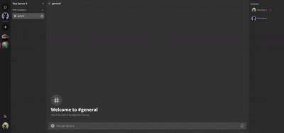

# ChatterSpace

  

## О проекте

ChatterSpace — это небольшой пет-проект, представляющий собой клон Discord, созданный с использованием Next.js. Этот проект был разработан с целью изучения и практики работы с Next.js, а также интеграции различных библиотек и инструментов.

## Демо

Проект задеплоен и доступен по ссылке: [ChatterSpace](https://chatter-space-rikcher.vercel.app/login)

[Website-preview]: ./assets/readme/Preview-1.png
[Website-preview2]: ./assets/readme/Preview-2.png
[Website-demo]: ./assets/readme/Demo.gif

![][Website-preview]
![][Website-preview2]

## Использованные технологии

### Основной стек
- **Next.js** – Фреймворк для React с поддержкой серверного рендеринга и статической генерации.
- **TypeScript** – Строго типизированное расширение JavaScript.
- **Tailwind CSS** – Утилитарный CSS-фреймворк для стилизации интерфейсов.
- **ShadCN UI** – Компонентная библиотека, основанная на Radix UI и Tailwind.
- **Zustand** – Легковесное и удобное состояние-менеджмент решение.

### Бэкенд и база данных
- **Supabase** – Бэкенд как сервис (BaaS), предоставляющий базу данных, аутентификацию и хранилище.
- **Prisma** – ORM для работы с базой данных.

### Видеозвонки и голосовые чаты
- **LiveKit** – Платформа для WebRTC-коммуникации, используемая для голосовых и видеочатов.

### Работа с формами и валидацией
- **React Hook Form** – Библиотека для управления формами в React.
- **Zod** – Библиотека для валидации и типизации данных.

### Дополнительные технологии
- **Lucide React** – Набор иконок для React.
- **React Query (TanStack Query)** – Удобное управление серверными данными.
- **Axios** – HTTP-клиент для работы с API.
- **UUID** – Генерация уникальных идентификаторов.

## Мотивация

Я решил заняться ChatterSpace (клоном Discord) в первую очередь для практики, расширения своих навыков и изучения новых технологий. Также это хороший способ углубить знания в тех областях, с которыми я уже знаком.

Изначально моя основная цель была изучить **Next.js**, а идея создать клон Discord появилась уже позже. Для меня такой проект логично реализовывать как SPA, и **React** отлично подходит для этой задачи. Однако, чтобы достичь своей главной цели — изучения **Next.js**, я выбрал именно этот фреймворк.

Помимо **Next.js**, я также решил попробовать:
- **Supabase** — как альтернативу Firebase для работы с базой данных, аутентификацией и хранилищем.
- **ShadCN UI** — новую для себя библиотеку компонентов, построенную на базе Radix UI и Tailwind CSS.

Этот проект стал отличной возможностью освоить современные технологии и улучшить свои навыки разработки.

(<a href="#readme-top">наверх</a>)
